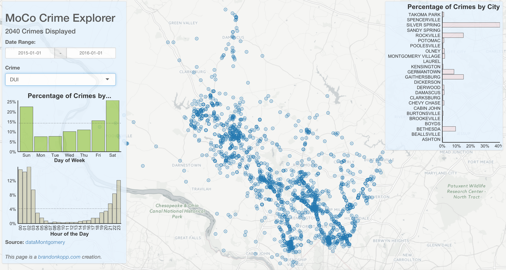

##Introduction
This repository contains example R and Shiny code for accessing an API containing geocoded data, creating a Leaflet map of those data, and allowing users to interact with the map via Shiny (see screenshot below).  The functional app can be viewed on shinyapps.io at <https://brandonkopp.shinyapps.io/MoCoCrimeExplorer> (NOTE: A free shinyapps account, which I have, only allows for 25 hours of use per month. If you can't access the app, check back toward the beginning of next month).

In this repository, you will also find the app.R code file. I added comments throughout.

##The API
This application accesses crime report data from Montgomery County, Maryland through the county's open data website, [dataMontgomery](https://data.montgomerycountymd.gov/developers/docs/crime). Crime reports are updated daily (though there is a lag of a day or two) so using an API, as opposed to a static table, is particularly powerful for showing contemporary data. Using an API is also great for maintaining a small storage footprint. The app.R file is only 12KB!

Montgomery County uses [Socrata](https://www.socrata.com/) as a platform for sharing dozens of datasets related to county government. These datasets are available for download in a number of formats and most can also be accessed through API requests. In the short time I've been working with open data, I've found Socrata to be a common platform used by county and city governments for sharing their data; see [Baltimore](https://data.baltimorecity.gov/) and [New York City](https://data.cityofnewyork.us/), for examples.  In working with the API, I found it particularly helpful to look at documentation on the [Socrata Developers Site](https://dev.socrata.com/).

##About Me
I am not a developer. This is, in fact, my first public release of any code I've put together since I started learning R around 6 months ago. In that time, I've learned through online courses (e.g., [Coursera](http://coursera.org)), documentation, message boards, and experimenting with code like this. For now, my data skills are limited to pulling data, reorganizing it, and presenting it in a useful way. My goal is to add value to the data through analysis and combination with other data sources.  So, more to come.

I don't have any particular interest in crime data. I first went to [dataMontgomery](https://data.montgomerycountymd.gov/) to find apartment cost data...an issue that hits a lot closer to home. Those data aren't available (yet!), but I'm getting myself prepared to make use of them when they do finally make it on the site.

This is a long way of saying that, if you have questions about R, Shiny, APIs, or crime-related data, I may not be the best person to ask. I will gladly try though.
